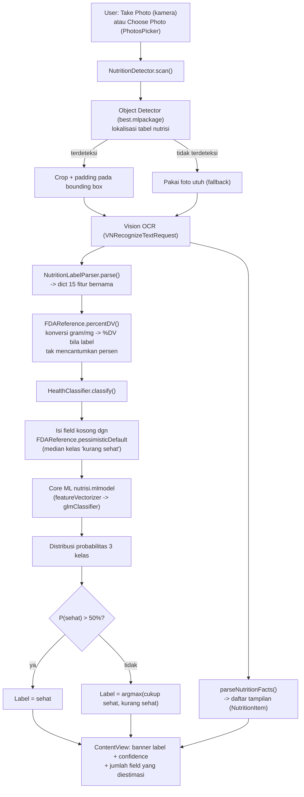

# NutriDe: Klasifikasi Kesehatan Makanan On-Device dari Label Nutrisi

**Status:** MVP (Minimum Viable Product) — iOS, Swift/SwiftUI + Core ML

---

## Abstrak

NutriDe adalah aplikasi iOS yang mengklasifikasikan makanan kemasan menjadi tiga kategori — **sehat**, **cukup sehat**, **kurang sehat** — dari hasil pemindaian label nilai gizi (nutrition facts label) menggunakan kamera atau galeri foto. Pipeline-nya menggabungkan object detection (melokalisasi tabel nutrisi dalam foto), OCR (Vision framework), parsing berbasis alias nutrisi ke 15 fitur numerik standar FDA, dan classifier tabular yang dilatih dengan Create ML. Proyek ini merupakan realisasi on-device dari pendekatan yang dipaparkan Steiner (2024) — *"Classifier for Foods: Healthy, Unhealthy, or Should be Consumed in Moderation"* — dengan skema fitur dan taksonomi 3-kelas yang sama, namun dataset pelatihan independen (221 baris, dilabeli dalam Bahasa Indonesia) dan algoritma hasil pemilihan otomatis Create ML (Logistic Regression / GLM, bukan KNN seperti pada paper acuan).

Dokumen ini mencatat arsitektur sistem, alur data/AI end-to-end, keputusan desain yang diambil selama pengembangan (khususnya penanganan data yang hilang dari hasil OCR), kelemahan yang diketahui, serta roadmap menuju produk pelacakan konsumsi yang terhubung ke data aktivitas (mis. Apple Health) dan lapisan saran berbasis generative AI.

---

## 1. Pendahuluan

### 1.1 Masalah

Konsumen sering salah menilai kesehatan suatu produk kemasan hanya dari klaim di kemasan depan ("rendah lemak", "less sugar", dsb.) tanpa membaca detail *Daily Value* (%DV) pada label nilai gizi — dan sebaliknya, produk yang sebenarnya aman dikonsumsi kadang dihindari karena persepsi keliru. Steiner (2024) mendokumentasikan masalah ini secara spesifik dan mengusulkan model machine learning tabular untuk menutup celah pengetahuan tersebut.

### 1.2 Rujukan: Steiner (2024)

Paper acuan membangun classifier 3-kelas dari 15 fitur label nutrisi (220 makanan, dilabeli manual oleh penulis berdasarkan pedoman FDA), membandingkan Decision Tree, KNN, SVM, dan Gaussian Naive Bayes. Model terbaik: **KNN (k=7)** dengan z-score scaling, SMOTE oversampling, dan PCA — akurasi **90.7%**, F1-score **90.57%**, mengungguli baseline CNN berbasis gambar (90.37%, hanya 2 kelas) yang dirujuk sebagai *related work*. Limitasi yang diakui penulis: dataset dilabeli oleh satu orang tanpa nutritionist, asumsi diet 2000 kkal, dan label nutrisi tidak menangkap aditif/pengawet/cara masak.

### 1.3 Kontribusi Proyek Ini

- Mengimplementasikan skema 15-fitur dan taksonomi 3-kelas yang sama menjadi **pipeline on-device** (kamera/galeri → deteksi tabel → OCR → parsing → klasifikasi), bukan pipeline riset offline berbasis CSV siap pakai seperti pada paper.
- Menghadapi masalah yang tidak muncul dalam setting riset paper: **hasil OCR dari foto nyata sering tidak lengkap** (pencahayaan, sudut, label rusak/tertutup). Bagian besar dari pekerjaan desain di proyek ini adalah menangani skenario *"beberapa dari 15 fitur tidak terbaca"* — sesuatu yang tidak dibahas paper acuan karena datasetnya selalu lengkap.
- Menyusun tabel konversi %DV berbasis rujukan resmi FDA (21 CFR 101.9(c)) untuk menangani label yang mencantumkan gram/mg mentah tanpa persentase.

---

## 2. Arsitektur Sistem

### 2.1 Komponen

| Komponen | File | Peran |
|---|---|---|
| Entry point | `nutrideApp.swift` | Root SwiftUI App |
| UI utama | `ContentView.swift` | Ambil foto (kamera/galeri), tampilkan daftar nutrisi mentah + banner klasifikasi |
| Kamera kustom | `CameraCaptureView.swift`, `CameraManager.swift` | Live preview + capture; punya jalur khusus untuk kamera Simulator (`SimulatorCameraClient`) karena Simulator tidak punya hardware kamera |
| Object detection + OCR | `NutritionDetector.swift` | Melokalisasi tabel nutrisi dalam foto (Core ML object detector) lalu OCR (`VNRecognizeTextRequest`) pada area tersebut |
| Parsing → fitur model | `NutritionLabelParser.swift` | Mengubah baris teks OCR menjadi dictionary 15 fitur bernama sesuai kolom training CSV |
| Referensi FDA + fallback | `FDAReference.swift` | Tabel Daily Value FDA untuk konversi gram/mg → %DV, dan nilai default pesimis untuk fitur yang tidak terbaca |
| Classifier | `HealthClassifier.swift` | Menjalankan model Core ML, menerapkan aturan keputusan (confidence threshold) |
| Model deteksi tabel | `best.mlpackage` | Object detector (Vision `VNRecognizedObjectObservation`) — melokalisasi *bounding box* tabel nutrisi |
| Model klasifikasi | `nutrisi.mlmodel` (dari `nutrisi.mlproj`) | Tabular classifier Create ML (pipeline `featureVectorizer → glmClassifier`) |

### 2.2 Dua Model Core ML yang Terpisah

Penting untuk dicatat bahwa proyek ini memakai **dua model Core ML independen** untuk dua tugas berbeda dalam pipeline yang sama:

1. **`best.mlpackage`** — object detector yang menjawab pertanyaan *"di mana tabel nutrisi dalam foto ini?"*. Dipakai lewat `VNCoreMLRequest`, hasilnya bounding box yang dipakai untuk crop foto sebelum OCR, meningkatkan akurasi OCR dengan membuang noise di luar tabel.
2. **`nutrisi.mlmodel`** — tabular classifier yang menjawab *"berdasarkan 15 angka ini, apakah makanannya sehat?"*. Tidak tahu-menahu soal gambar sama sekali — input-nya murni angka.

Keduanya dijalankan lewat `MLModelConfiguration`. Ditemukan selama debugging bahwa iOS Simulator tidak punya Neural Engine dan backend MPSGraph-nya menolak model object detector (*"Espresso exception: MpsGraph backend validation on incompatible OS"*), sehingga kedua model dipaksa `computeUnits = .cpuOnly` khusus saat `#if targetEnvironment(simulator)` — device asli tetap memakai GPU/Neural Engine penuh.

### 2.3 Diagram Alur

### 2.4 Alur Data/AI End-to-End (naratif)

1. **Input**: pengguna mengambil foto lewat kamera kustom, atau memilih foto lewat `PhotosPicker` (iOS 16+, tidak butuh izin akses galeri penuh karena berjalan out-of-process).
2. **Deteksi tabel**: `best.mlpackage` mencari bounding box tabel nutrisi; jika tidak ketemu atau crop gagal menghasilkan teks yang bisa di-parse, sistem fallback ke OCR seluruh foto.
3. **OCR**: `VNRecognizeTextRequest` level akurat, tanpa koreksi bahasa (nutrisi bukan teks natural), diurutkan dari atas ke bawah berdasarkan bounding box.
4. **Dua jalur parsing dari baris OCR yang sama**:
   - `NutritionDetector.parseNutritionFacts` — regex generik `nama: angka+satuan`, untuk daftar tampilan mentah di UI (apa adanya, tidak divalidasi terhadap skema model).
   - `NutritionLabelParser.parse` — pencarian berbasis alias per nutrisi (mis. "saturated fat"/"sat fat" → `.satFatDV`), lalu ambil angka %DV pertama di baris tersebut, atau angka gram/mg lalu dikonversi ke %DV via `FDAReference.percentDV`. Ini juga otomatis menangani format "Includes 8g Added Sugars 16%" karena angka dan nama nutrisi tidak harus bersebelahan.
5. **Konversi %DV**: 10 dari 15 fitur adalah kolom %DV (Total Fat, Sat Fat, Cholesterol, Sodium, Carbs, Added Sugars, Vitamin D, Calcium, Iron, Potassium) — dikonversi dari gram/mg/mcg/IU memakai tabel Daily Value FDA resmi (21 CFR 101.9(c), revisi 2016/2020), dibulatkan ke bilangan bulat karena tipe input Core ML untuk kolom-kolom ini adalah `Int64`.
6. **Imputasi field yang hilang**: field yang tidak ketemu sama sekali di hasil OCR diisi dari `FDAReference.pessimisticDefault` — **median dari 51 baris kelas "kurang sehat"** di dataset training, bukan rata-rata/median seluruh dataset. Ini keputusan desain yang disengaja (lihat §3).
7. **Inferensi**: `nutrisi.mlmodel` — pipeline dua tahap `featureVectorizer → glmClassifier` (logistic regression, hasil pemilihan algoritma otomatis Create ML) — menghasilkan distribusi probabilitas atas 3 kelas.
8. **Aturan keputusan**: label "sehat" hanya diterima jika probabilitasnya **> 50%** (menang mutlak lawan gabungan dua kelas lain). Jika tidak, sistem memilih kelas dengan probabilitas tertinggi di antara "cukup sehat"/"kurang sehat" — **tidak ada** aturan simetris yang menahan kelas "kurang sehat" dengan cara yang sama (lihat §3).
9. **Tampilan**: `ContentView` menampilkan label + confidence dari kelas yang sudah di-resolve, plus jumlah field yang diestimasi (transparansi ke pengguna soal keandalan hasil).

---

## 3. Keputusan Desain Kunci — Menangani Ketidaklengkapan Data

Bagian ini secara khusus mendokumentasikan masalah yang **tidak dibahas oleh paper acuan** karena dataset risetnya selalu lengkap, tapi jadi masalah nyata pertama begitu pipeline dijalankan di atas foto asli.

### 3.1 Model Tidak Punya Toleransi Native terhadap Missing Value

Inspeksi langsung terhadap spesifikasi `nutrisi.mlmodel` (via `coremltools`) menunjukkan:

- Pipeline-nya adalah **`featureVectorizer → glmClassifier`** (logistic regression), bukan tree ensemble. Ini hasil pemilihan otomatis Create ML ("Automatic" algorithm), bukan keputusan eksplisit — Create ML memilih GLM karena skornya tertinggi pada data lengkap.
- **10 dari 15 input bertipe `Int64`** pada level Core ML (semua kolom %DV) — Int64 secara fundamental tidak bisa merepresentasikan NaN, berbeda dari Double.
- **Seluruh 15 input ditandai `isOptional: false`** — tidak ada field yang boleh kosong sama sekali di level model.
- GLM melakukan kombinasi linear atas semua fitur; satu NaN akan merambat ke semua skor kelas (`NaN × bobot = NaN`), bukan "dilewati" seperti pada tree ensemble yang punya *default branch* untuk nilai hilang (`branchOnValueMissing`).

**Kesimpulan:** model saat ini secara arsitektural tidak bisa "menerima data kosong" — solusi harus di sisi aplikasi (imputasi sebelum inferensi), bukan konfigurasi model.

### 3.2 Median Keseluruhan Dataset Terbukti Salah

Percobaan awal mengisi field kosong dengan median seluruh dataset (netral secara statistik) menghasilkan kesalahan nyata: baris yang seharusnya "kurang sehat" berbalik menjadi "cukup sehat" atau bahkan "sehat" ketika banyak field hilang bersamaan. Sebabnya: median keseluruhan dataset berada dekat area "cukup sehat" (kelas tengah), sehingga mengisi banyak field sekaligus dengan nilai ini "mencuci" sinyal ekstrem dari field yang justru berhasil terbaca.

Pengujian dengan menjatuhkan field secara bertahap dari sebuah baris "kurang sehat" (Calories 250, Total Fat 25%, Sat Fat 30%, dst.) mengonfirmasi ini:

| Field hilang | Imputasi median (lama) | Imputasi pesimis (baru) |
|---|---|---|
| 0–11 dari 14 | tetap *kurang sehat* (100%) | tetap *kurang sehat* (100%) |
| 12 dari 14 | berbalik ke **sehat** (43.1%) ❌ | tetap **kurang sehat** (93.3%) ✅ |
| 14 dari 14 (cuma Calories tersisa) | **sehat** (76.6%) ❌ | tetap **kurang sehat** (96.2%) ✅ |

### 3.3 Solusi: Imputasi Pesimis + Ambang Keputusan Asimetris

Dua lapisan mitigasi diterapkan, keduanya sengaja **asimetris** (memberatkan ke arah "waspada", bukan netral):

1. **Input layer** (`FDAReference.pessimisticDefault`): field kosong diisi dengan median dari 51 baris kelas "kurang sehat" saja, bukan median seluruh dataset — "anggap kasus terburuk sampai terbukti sebaliknya."
2. **Decision layer** (`HealthClassifier.resolveLabel`): label "sehat" harus menang **mutlak (>50%)**; kemenangan tipis (mis. 41% sehat vs 35% cukup sehat vs 24% kurang sehat, kasus nyata yang ditemukan saat testing di device) di-downgrade ke kelas runner-up tertinggi. Tidak ada ambang setara untuk "kurang sehat" — konsisten dengan prinsip yang juga ditekankan Steiner (2024): kesalahan prediksi antara kelas sehat↔tidak sehat jauh lebih berbahaya daripada kesalahan di kelas menengah.

**Trade-off yang perlu diakui secara eksplisit:** desain ini menukar satu mode kegagalan (makanan tidak sehat lolos sebagai "sehat") dengan mode kegagalan lain yang lebih ringan tapi tetap nyata (makanan yang sebenarnya sehat, tapi hasil scan-nya buruk/tidak lengkap, berisiko salah dicap "kurang sehat"). Ini keputusan sadar untuk konteks aplikasi kesehatan, bukan solusi tanpa biaya — lihat §4.2.

---

## 4. Kelemahan (Limitations)

### 4.1 Dataset tidak merepresentasikan nilai kosong

Ini akar masalah di §3. Dataset training (221 baris, `healthy - labels_refine.csv`) **tidak punya satu pun baris dengan field kosong** — baik model maupun proses pelabelannya tidak pernah "melihat" ketidaklengkapan. Mitigasi saat ini (§3.3) adalah heuristik di sisi aplikasi yang ditempelkan di atas model yang secara arsitektural kaku, bukan model yang betul-betul memahami "tidak diketahui". Ini bekerja cukup baik pada pengujian sintetis, tapi belum divalidasi terhadap distribusi kegagalan OCR yang sesungguhnya di lapangan.

### 4.2 Trade-off asimetris belum divalidasi dengan data nyata

§3.3 menukar risiko "false negative pada makanan tidak sehat" dengan risiko "false negative pada makanan sehat". Ini keputusan yang masuk akal secara prinsip, tapi baru diverifikasi lewat skenario sintetis (baris test yang field-nya dihapus manual secara terkontrol), bukan lewat distribusi kegagalan OCR sungguhan dari banyak pengguna/label. Perlu instrumentasi lapangan untuk tahu apakah trade-off ini benar-benar net-positive.

### 4.3 Dataset kecil dan berlabel subjektif

221 baris, dilabeli manual tanpa keterlibatan nutritionist — limitasi yang sama persis yang diakui Steiner (2024) untuk dataset 220-nya. Standar %DV yang dipakai (FDA, diet 2000 kkal) bukan standar Indonesia (BPOM/AKG) dan tidak disesuaikan per kebutuhan kalori individu pengguna.

### 4.4 Tidak ada metrik validasi untuk model yang benar-benar dipakai

Folder `Model Containers` dan `Snapshots` pada `nutrisi.mlproj` kosong — tidak ada confusion matrix, akurasi, atau F1-score yang tercatat untuk `nutrisi.mlmodel` versi yang di-bundle ke aplikasi. Berbeda dengan paper acuan yang melaporkan metrik lengkap (90.7% akurasi, F1 90.57%, confusion matrix per kelas), proyek ini saat ini tidak punya angka yang bisa dipertanggungjawabkan untuk model yang sebenarnya jalan di device.

### 4.5 Parser hanya mengenali istilah label Bahasa Inggris (format FDA)

`NutritionLabelParser` mencari alias seperti `"total fat"`, `"saturated fat"`, `"sodium"`, dst. — format label AS. Produk Indonesia memakai format **Informasi Nilai Gizi** (Lemak Total, Lemak Jenuh, Natrium, %AKG, dst.) yang **belum dikenali sama sekali** oleh parser saat ini. Ini gap signifikan mengingat UI dan target pasar aplikasi ini berbahasa Indonesia — sebagian besar produk yang akan di-scan pengguna nyata kemungkinan besar memakai format lokal, bukan format FDA.

### 4.6 Object detector tidak punya metrik terukur

Sama seperti classifier, `best.mlpackage` (lokalisasi tabel nutrisi) tidak punya precision/recall yang tercatat. Kegagalan deteksi memang sudah punya fallback (OCR seluruh foto), tapi seberapa sering fallback ini terpakai — dan seberapa besar itu menurunkan kualitas OCR — belum diukur.

### 4.7 Tidak ada normalisasi takaran saji (serving size)

%DV pada label mengasumsikan takaran saji yang tercantum di kemasan, yang bervariasi antar produk. Parser saat ini tidak mengekstrak/memvalidasi takaran saji, sehingga dua produk dengan takaran saji yang jauh berbeda diperlakukan setara oleh classifier. Steiner (2024) juga menyinggung keterbatasan serupa (§6 pada paper).

---

## 5. Yang Perlu Ditingkatkan

Diurutkan kira-kira dari yang berdampak paling langsung ke pengalaman pengguna Indonesia:

1. **Tambahkan alias Bahasa Indonesia** ke `NutritionLabelParser` (Lemak Total, Lemak Jenuh, Kolesterol, Natrium, Karbohidrat Total, Serat Pangan, Gula Total, Gula Tambahan, Protein, Vitamin D, Kalsium, Zat Besi, Kalium, %AKG) — ini kemungkinan gap dengan dampak terbesar karena menyangkut apakah aplikasi bisa membaca produk lokal sama sekali.
2. **Catat metrik validasi** untuk `nutrisi.mlmodel` — retrain dengan train/test split eksplisit yang dicatat, publikasikan confusion matrix seperti paper acuan.
3. **Evaluasi retrain dengan algoritma tree-based** (Boosted Tree/Random Forest, dipilih eksplisit — bukan "Automatic") sebagai alternatif GLM saat ini, karena tree punya jalur native untuk toleransi missing value (`branchOnValueMissing`) di level Core ML. Ini idealnya dikombinasikan dengan augmentasi data (menambahkan salinan sintetis dari 221 baris dengan sebagian kolom sengaja dikosongkan, label tetap sama) supaya model benar-benar *belajar* menjadi robust terhadap data hilang — bukan cuma diberi mekanisme fallback tanpa pernah dilatih memakainya.
4. **Ekstraksi & validasi takaran saji** dari OCR untuk normalisasi %DV lintas produk.
5. **Instrumentasi lapangan** (dengan consent pengguna): log field mana yang paling sering gagal terbaca, dan seberapa sering aturan pesimis/threshold 50% ini benar-benar mengubah hasil — untuk memvalidasi trade-off di §4.2 dengan data sungguhan, bukan cuma skenario sintetis.
6. **Evaluasi akurasi object detector** (`best.mlpackage`) pada variasi sudut/pencahayaan/kemasan melengkung.

---

## 6. Visi & Roadmap (Potensi)

Tujuan besar proyek ini bukan cuma klasifikasi satu-kali-scan, melainkan alat bantu **pelacakan konsumsi harian** yang terhubung ke data aktivitas pengguna, dengan lapisan saran personal berbasis generative AI di ujungnya.

### Fase 1 — MVP saat ini
Scan satu label → ekstraksi 15 fitur → klasifikasi 3 kelas. *(Selesai, didokumentasikan di atas.)*

### Fase 2 — Pelacakan Konsumsi (Consumption Tracking)
- Simpan setiap hasil scan (nama produk bila tersedia, 15 fitur mentah, hasil klasifikasi, timestamp) secara lokal (mis. SwiftData/Core Data).
- Agregasi harian/mingguan: total gram gula tambahan hari ini, total %DV natrium yang sudah dikonsumsi vs anggaran harian FDA, tren mingguan proporsi makanan sehat/cukup sehat/kurang sehat.

### Fase 3 — Integrasi Data Kesehatan (mis. Apple HealthKit)
- **Baca** dari HealthKit: jumlah langkah, energi aktif, menit olahraga — dikorelasikan dengan asupan yang sudah dilacak di Fase 2 (contoh konkret dari brief: *"hari ini user sudah intake berapa gram gula, dan berapa jumlah langkah dari jalan kaki-nya"*).
- **Tulis** ke HealthKit: kontribusi nutrisi harian (gula, natrium, dsb.) sebagai `HKQuantitySample`, supaya NutriDe jadi bagian dari ekosistem app kesehatan pengguna secara dua arah, bukan silo terpisah.

### Fase 4 — Lapisan Saran Generative AI
- Kirim ringkasan terstruktur (asupan harian dari Fase 2 + data aktivitas dari Fase 3) ke API model bahasa (Claude atau OpenAI) untuk menghasilkan saran personal dalam bahasa natural — contoh dari brief: *"sebaiknya jalan kaki lebih banyak"* atau *"sebaiknya makanan/minuman ini jangan dikonsumsi dulu"*.
- **Prinsip desain penting:** LLM berperan sebagai lapisan *phrasing & personalisasi* di atas angka-angka yang sudah pasti (hasil classifier + agregasi HealthKit yang deterministik), **bukan** sumber kebenaran soal sehat/tidaknya suatu makanan atau angka nutrisi — supaya tidak ada risiko halusinasi klaim kesehatan. LLM diberi data terstruktur sebagai konteks, bukan diminta menghitung ulang %DV atau mengklasifikasi ulang dari nol.
- Potensi lanjutan: personalisasi berbasis profil pengguna (usia, berat badan, tingkat aktivitas, target diet) menggantikan asumsi flat 2000-kkal FDA; dashboard tren/insight; pencarian database barcode produk sebagai jalur lebih cepat dibanding OCR ketika datanya tersedia.

---

## 7. Kesimpulan

NutriDe membuktikan bahwa pendekatan klasifikasi 3-kelas dari Steiner (2024) bisa direalisasikan sebagai pipeline on-device yang berjalan penuh di iOS tanpa server, memakai kombinasi Vision (object detection + OCR) dan Core ML (tabular classifier). Kontribusi utama pekerjaan sejauh ini bukan pada algoritma klasifikasinya sendiri (yang notabene dipilih otomatis oleh Create ML, bukan hasil riset algoritma seperti paper acuan), melainkan pada **rekayasa robustness** untuk menghadapi kenyataan bahwa data hasil OCR dari foto asli jarang selengkap dataset riset yang rapi — sesuatu yang perlu ditangani secara eksplisit lewat kombinasi konversi %DV berbasis FDA, imputasi pesimis, dan ambang keputusan asimetris.

Kelemahan terbesar yang masih terbuka adalah kesenjangan antara apa yang dilatihkan ke model (data selalu lengkap) dan kondisi nyata di lapangan (data sering tidak lengkap) — solusi jangka pendek (heuristik pesimis) sudah terbukti menutup gejala paling parah, tapi solusi jangka panjang yang lebih benar (retrain dengan data yang memang merepresentasikan ketidaklengkapan) masih jadi pekerjaan rumah. Di luar itu, dukungan format label Indonesia adalah gap paling mendesak untuk kesiapan pasar lokal.

---

## Referensi

1. Steiner, N. (2024). *Classifier for Foods: Healthy, Unhealthy, or Should be Consumed in Moderation*. Oakland University. (Laporan terlampir: `Healthy Foods Classifier Report.pdf`)
2. U.S. Food and Drug Administration. *Daily Value on the Nutrition and Supplement Facts Labels*, 21 CFR 101.9(c), revisi 5 Maret 2024. https://www.fda.gov/food/nutrition-facts-label/daily-value-nutrition-and-supplement-facts-labels
3. Dataset training internal: `healthy - labels_refine.csv` (221 baris; 108 sehat / 62 cukup sehat / 51 kurang sehat), dikelola lewat `nutrisi.mlproj` (Create ML, Tabular Classifier).
